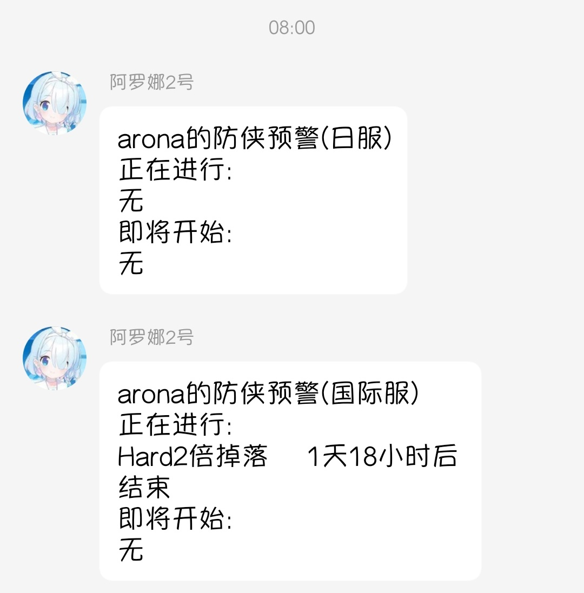
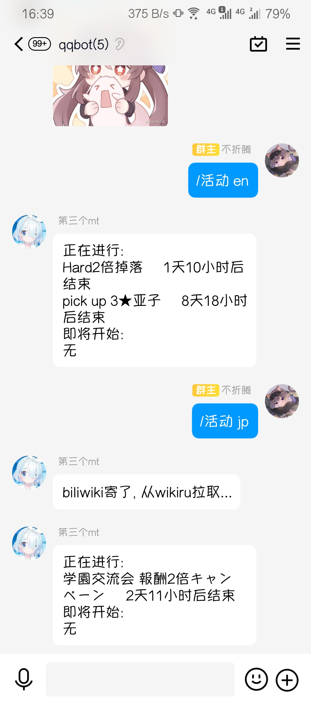
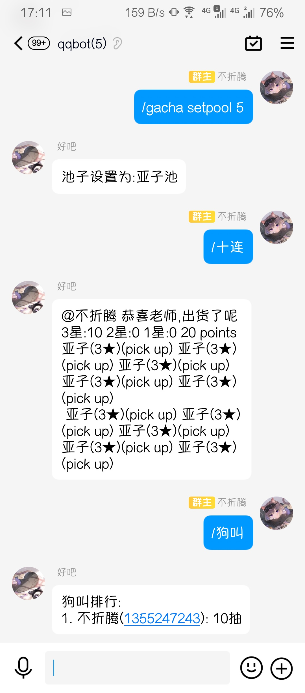
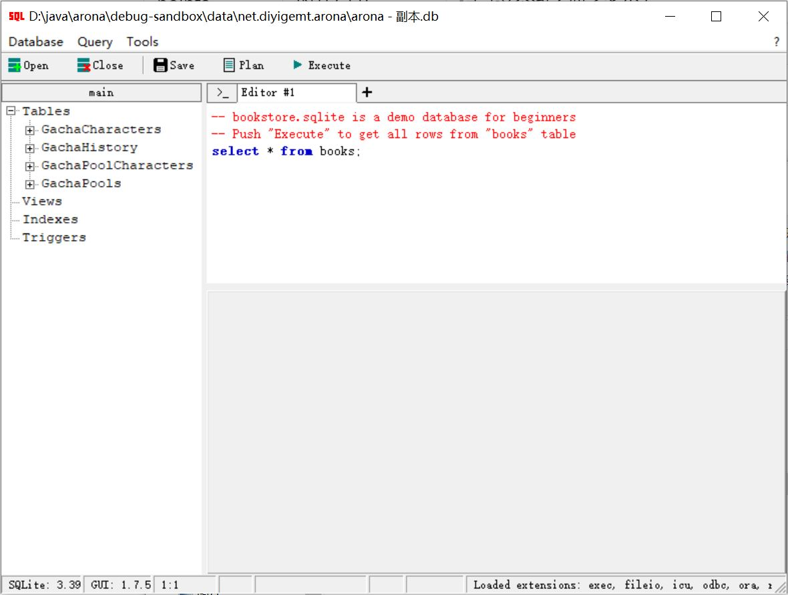
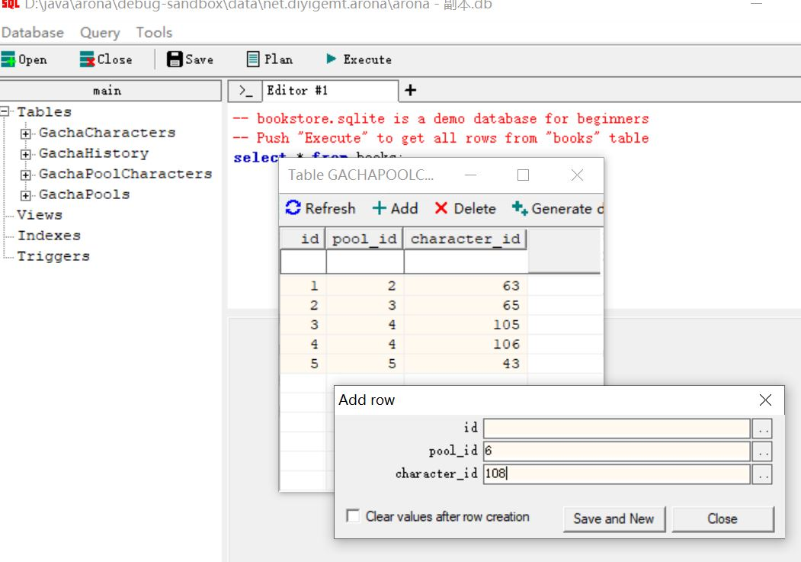
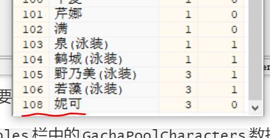

## 声明

<h3>一切开发旨在学习，请勿用于非法用途</h3>

- arona 是一款免费且开放源代码的软件，仅供学习和娱乐用途使用。
- arona 不会通过任何方式强制收取费用，或对使用者提出物质条件。
- arona 由整个开源社区维护，并不是属于某个个体的作品，所有贡献者都享有其作品的著作权。

## 许可证

详见 https://github.com/diyigemt/arona/blob/master/LICENSE

arona 继承 [Mirai](https://github.com/mamoe/mirai) 使用 AGPLv3 协议开源。为了整个社区的良性发展，我们强烈建议您做到以下几点：

- 间接接触到 arona 的软件使用 AGPLv3 开源
- **不鼓励，不支持一切商业使用**

请注意，由于种种原因，开发者可能在任何时间**停止更新**或**删除项目**。

### 衍生软件需声明引用

- 若引用 arona 发布的软件包而不修改 arona ，则衍生项目需在描述的任意部位提及使用 arona 。
- 若修改 arona 源代码再发布，或参考 arona 内部实现发布另一个项目，则衍生项目必须在文章首部或 'miraiboot' 相关内容首次出现的位置明确声明来源于本仓库 ([arona](https://github.com/diyigemt/arona))。
- 不得扭曲或隐藏免费且开源的事实。

## Statement

<h3>All development is for learning, please do not use it for illegal purposes</h3>

- arona is a free and open source software for learning and entertainment purposes only.
- arona will not compulsorily charge fees or impose material conditions on users in any way.
- arona is maintained by the entire open source community and is not a work belonging to an individual. All contributors enjoy the copyright of their work.

## License

See https://github.com/diyigemt/arona/blob/master/LICENSE for details

arona inherits [Mirai](https://github.com/mamoe/mirai) Open source using AGPLv3 protocol. For the healthy development of the entire community, we strongly recommend that you do the following:

- Software indirectly exposed to arona uses AGPLv3 open source
- **Does not encourage and does not support all commercial use**

Please note that for various reasons, developers may **stop updating** or **deleting** projects at any time.

### Derivative software needs to declare and quote

- If you quote the package released by arona without modifying arona , the derivative project needs to mention miraiboot in any part of the description.
- If the arona source code is modified and then released, or another project is released by referring to arona's internal implementation, the derivative project must be clearly stated in the first part of the article or at the location where 'arona'-related content first appears from this repository ([arona](https://github.com/diyigemt/arona)).
- The fact that it is free and open source must not be distorted or hidden.

## 介绍

arona是基于mirai-console的插件。

**本插件依赖的mirai-console版本为2.11.1**

作为BA(Blue Archive)的一款群助手，她可以实现以下功能：

1. 抽卡模拟及数据记录；
2. 国际服/日服活动推送以及防侠提醒；
3. 摸头回复。

活动推送：



活动结束前防侠：


活动日历：



抽卡模拟：



戳一戳：


## 使用方法

以下需要

1. 在[releases](https://github.com/diyigemt/arona/releases)下载最新版本的jar包并放入mirai-console的`plugins`目录下；
2. 启动mirai-console，等到显示如下字样后退出：

```bash
2022-07-02 21:27:03 I/arona: arona database init success.
2022-07-02 21:27:03 I/arona: arona loaded
2022-07-02 21:27:04 I/arona: arona gacha module init success.
```

3. 在[releases](https://github.com/diyigemt/arona/releases)下载最新版本的arona.db的SQLite文件并替换掉`./data/net.diyigemt.arona/arona.db`文件；
4. 在`./config/net.diyigemt.arona/`文件夹下根据自己的喜好编辑arona的配置文件，具体内容将会在下一节解释；
5. 再次运行mirai-console即可享受arona的服务。

**注意**，arona的运行依赖`chat-command`插件，你可以在[这里](https://github.com/project-mirai/chat-command)找到它的下载链接
**本插件依赖的mirai-console版本为2.11.1**

## 注意事项

arona的运行依赖`chat-command`插件，因此在使用arona的指令之前，需要给予指令使用权限。

arona一共提供了如下的指令：

| 指令权限组                               | 内置权限控制 | 作用                    |
| ---------------------------------------- | ------------ | ----------------------- |
| net.diyigemt.arona:command.active        | 群员         | 获取国际服/日服活动状态 |
| net.diyigemt.arona:command.gacha         | 管理员       | 配置抽卡参数            |
| net.diyigemt.arona:command.gacha_one     | 群员         | 单抽                    |
| net.diyigemt.arona:command.gacha_multi   | 群员         | 十连                    |
| net.diyigemt.arona:command.gacha_dog     | 群员         | 查看pickup最小抽取记录  |
| net.diyigemt.arona:command.gacha_history | 群员         | 查看抽卡记录            |
| net.diyigemt.arona:command.hentai        | 管理员       | 配置发情关键词回复      |

如果你不是很了解mirai-console的权限管理机制，你可以直接在mirai-console的界面中运行以下命令来直接激活arona的响应权限：

```bash
/permission add * net.diyigemt.arona:command.active
/permission add * net.diyigemt.arona:command.gacha
/permission add * net.diyigemt.arona:command.gacha_one
/permission add * net.diyigemt.arona:command.gacha_multi
/permission add * net.diyigemt.arona:command.gacha_dog
/permission add * net.diyigemt.arona:command.gacha_history
/permission add * net.diyigemt.arona:command.hentai
```

## 指令详解

| 指令                             | 别名                               | 作用                                             |
| -------------------------------- | ---------------------------------- | :----------------------------------------------- |
| /活动 en                         | /active en                         | 获取国际服活动状态                               |
| /活动 jp                         | /active jp                         | 获取日服活动状态                                 |
| /单抽                            | /gacha_one                         | 单抽一次                                         |
| /十连                            | /gacha_multi                       | 十连                                             |
| /狗叫                            | /gacha_dog                         | 查看最低抽出pickup次数排行榜                     |
| /历史                            | /gacha_history                     | 查看抽卡历史记录/几抽1个3星                      |
| /抽卡 setpool \<number\>         | /gacha setpool \<number\>          | 设置当前池子为数据库中指定的[number]             |
| /抽卡 reset                      | /gacha reset                       | 重置当前池子的抽卡记录                           |
| /发情 adds \<string> [number]    | /hentai adds \<string\> [number]   | 为发情添加一条回复语句(string)并指定权重为number |
| /发情 adds {number \| @member}   | /hentai add {number \| @member}    | 添加一个发情的监听对象(群友)                     |
| /发情 remove {number \| @member} | /hentai remove {number \| @member} | 删除一个发情的监听对象(群友)                     |
| /发情 enable                     | /hentai enable                     | 启用发情监听                                     |
| /发情 disable                    | /hentai disable                    | 停用发情监听                                     |

## 配置文件详解

### 1.arona.yml

arona总的配置。

| 键                 | 属性         | 作用                        |
| ------------------ | ------------ | --------------------------- |
| qq                 | Long         | 指定arona运行在哪个机器人上 |
| groups             | List\<Long\> | 指定arona响应哪个群的消息   |
| sendOnlineMessage  | Boolean      | 是否发送arona上线消息       |
| onlineMessage      | String       | 上线消息内容                |
| sendOfflineMessage | Boolean      | 是否发送arona下线消息       |
| offlineMessage     | String       | 下线消息内容                |

### 2.arona-gacha.yml

抽卡模块配置。

**注意**1、2、3星总出率加起来需要达到100%，2、3星限定出率不能超过各自的总出率。

当前激活的池子的设置与数据库有关，将会在下一节进行讨论。

| 键              | 属性    | 作用                     |
| --------------- | ------- | ------------------------ |
| star1Rate       | Float   | 1星总出率百分比          |
| star2Rate       | Float   | 2星总出率百分比          |
| star3Rate       | Float   | 3星总出率百分比          |
| star2PickupRate | Float   | 2星限定出率百分比        |
| star3PickupRate | Float   | 3星限定出率百分比        |
| activePool      | Int     | 当前激活的池子           |
| revoke          | Boolean | 是否撤回结果信息防止刷屏 |

### 3.arona-gacha-limit.yml

抽卡限制模块设置。其中**只需要**配置limit字段，另外两个字段由arona自动维护。

| 键         | 属性                   | 作用                                                |
| ---------- | ---------------------- | --------------------------------------------------- |
| record     | List\<Pair\<Long,Int>> | 保存抽卡限制信息，Long为群员QQ号，Int为今天抽卡次数 |
| lastUpdate | Int                    | 保存上一次更新抽卡信息的日期                        |
| limit      | Int                    | 每天没人最多抽几次，设置为0表示不限制               |

### 4.arona-notify.yml

防侠通知模块设置。**注意**，时间按24小时计。

除了双倍掉落需要额外配置外，防侠提醒会在活动结束前1个小时进行，因为双倍掉落是在晚上3点结束，2点提醒有点阴间。

| 键             | 属性    | 作用                                          |
| -------------- | ------- | --------------------------------------------- |
| enable         | Boolean | 是否启用防侠提醒功能                          |
| enableEveryDay | Boolean | 是否启用每日防侠提醒功能                      |
| everyDayHour   | Boolean | 每日防侠提醒的时间(同时也是每日数据更新时间)  |
| enableJP       | Boolean | 是否启用日服防侠提醒                          |
| notifyStringJP | Int     | 日服防侠提醒开头文字                          |
| enableEN       | Boolean | 是否启用国际服防侠提醒                        |
| notifyStringEN | Int     | 国际服防侠提醒开头文字                        |
| dropNotify     | Int     | 双倍掉落防侠提醒的时间(因为一般是晚上3点结束) |

### 5.arona-nudge.yml

摸头模块配置。

| 键          | 属性                       | 作用                            |
| ----------- | -------------------------- | ------------------------------- |
| enable      | Boolean                    | 是否启用摸头功能                |
| messageList | List<Data<String, weight>> | 回复消息列表以及权重            |
| priority    | EventPriority              | 事件优先级，与mirai-console有关 |

### 6.arona-repeat.yml

复读模块配置。

| 键     | 属性    | 作用                               |
| ------ | ------- | ---------------------------------- |
| enable | Boolean | 是否启用复读功能                   |
| times  | Int     | 当一条消息被重复几次后进行一次复读 |

### 7.arona-hentai.yml

发情回怼模块配置。目前只会对消息内容中含有"老婆"或者"老公"字样的消息进行回复。

作用是应对群友互相发情的，可以不用管。

| 键          | 属性                       | 作用                 |
| ----------- | -------------------------- | -------------------- |
| enable      | Boolean                    | 是否启用发情回怼功能 |
| messageList | List<Data<String, weight>> | 回复消息列表以及权重 |
| listen      | List\<Long>                | 监听的群友QQ号       |

## 数据库详解

**注意**可能会夹带私货。

数据库目前有四张表，主要是为了抽卡模块服务。

1.GachaCharacters表

用以保存池子中的所有老婆信息并区分是否是限定。

| 键    | 属性        | 作用           |
| ----- | ----------- | -------------- |
| id    | INTEGER     | 主键           |
| name  | VARCHAR(10) | 老婆名字       |
| star  | INT         | 老婆初始星级   |
| limit | BOOL        | 老婆是否是限定 |

2.GachaPools表

用以保存各池子的信息。

| 键   | 属性        | 作用     |
| ---- | ----------- | -------- |
| id   | INTEGER     | 主键     |
| name | VARCHAR(50) | 池子名字 |

3.GachaPoolCharacters表

用以保存各池子中限定pickup的信息。

| 键           | 属性    | 作用                   |
| ------------ | ------- | ---------------------- |
| id           | INTEGER | 主键                   |
| pool_id      | INTEGER | 外键，指向限定池表主键 |
| character_id | INTEGER | 外键，指向老婆表主键   |

4.GachaHistoryTable表

用以保存抽卡记录。

| 键     | 属性    | 作用                                              |
| ------ | ------- | ------------------------------------------------- |
| qq     | BIGINT  | 主键1，也是群员QQ号                               |
| group  | BIGINT  | 主键2，群员所在群号                               |
| pool   | INTEGER | 主键3，外键，指向限定池表主键，区分不同池子的记录 |
| points | INTEGER | 记录这个池子抽了多少发                            |
| count3 | INTEGER | 记录抽出几个三星                                  |
| dog    | INTEGER | 记录几抽抽出pickup                                |

目前数据库中记录了5个池子，它们的id的对应内容为：

| id   | 内容        |
| ---- | ----------- |
| 1    | 普池        |
| 2    | 初音池      |
| 3    | 公主池      |
| 4    | nnm大狐狸池 |
| 5    | 亚子池      |

### 新卡池添加方法

1. 停止mirai-console的运行；
2. 从`./data/net.diyigemt.arona/arona.db`获取db文件；
3. 编辑db文件，在GachaCharacters表中插入新老婆的信息；
4. 在GachaPools表中插入新池的信息；
5. 在GachaPoolCharacters表中插入新池与限定角色的关联信息；
6. 使用编辑好的数据库文件替换`./data/net.diyigemt.arona/arona.db`下的文件；
7. 启动mirai-console，在群聊中发送指令`/gacha setpool <number>`，其中number为第4步中新池的主键

如果你不会使用SQLite也没关系，下面我模拟一下这种情况，比如日服新出了粉狐狸然后up了，该如何添加这个池子。

1. 下载任意一个可以编辑SQLite的软件，比如[sqlite-gui](https://github.com/little-brother/sqlite-gui/releases/download/1.7.5/sqlite-gui.1.7.5-x64.zip)
2. 使用工具栏中的`open`选项打开获取到的池子文件，如下图



3. 双击`Tables`栏中的`GachaCharacters`数据表，编辑新老婆信息


其中`name`为老婆名字;`star`为老婆初始星级；`limit`表示老婆是限定还是常驻，其中1表示限定、0表示常驻；`id`为自动生成，无需填写。

填写完毕后单击`Save and New`保存，即可关闭页面。

4. 双击`Tables`栏中的`GachaPools`数据表，编辑新池子信息


同上，只需要填入`name`作为新池子的名字即可。

5. 双击`Tables`栏中的`GachaPoolCharacters`数据表，编辑新池子与新老婆的对应关系信息



其中`pool_id`为之前新建池子的主键，可以在这里看到


同理，`character_id`为之前新建的老婆信息的主键



**特别的**，一个池子可以有多个pickup，因此可以根据需要在`GachaPoolCharacters`对同一个池子添加多条数据。

至此，数据库编辑完毕。

6. 使用编辑好的数据库文件替换`./data/net.diyigemt.arona/arona.db`文件；
7. 启动mirai-cosole，在群聊中发送指令`/gacha setpool <number>`，其中number为第4步中新池的主键，即可启用新的池子。

## 鸣谢

[超级课程表](https://github.com/StageGuard/SuperCourseTimetableBot)(数据库支持)

[碧蓝档案国际服情报站](https://space.bilibili.com/1585224247)(国际服活动信息来源)

[碧蓝档案wiki](https://wiki.biligame.com/bluearchive/%E9%A6%96%E9%A1%B5)(日服活动信息来源1)

[碧蓝档案wikiru](https://bluearchive.wikiru.jp/)(日服活动信息来源2)

[mirai](https://github.com/mamoe/mirai)(技术支持)

非正常学生研究委员会群友(陪我闲聊)

[**Haythem723**](https://github.com/Haythem723)(陪我闲聊)