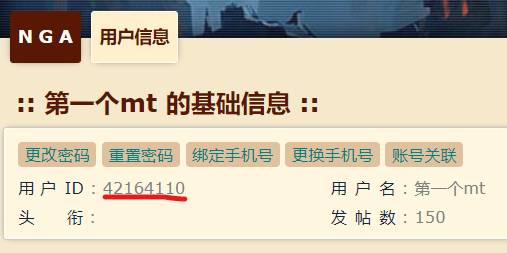
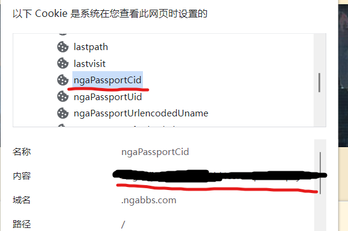

## 声明

<h3>一切开发旨在学习，请勿用于非法用途</h3>

- arona 是一款免费且开放源代码的软件，仅供学习和娱乐用途使用。
- arona 不会通过任何方式强制收取费用，或对使用者提出物质条件。
- arona 由整个开源社区维护，并不是属于某个个体的作品，所有贡献者都享有其作品的著作权。

## 许可证

详见 https://github.com/diyigemt/arona/blob/master/LICENSE

arona 继承 [Mirai](https://github.com/mamoe/mirai) 使用 AGPLv3 协议开源。为了整个社区的良性发展，我们强烈建议您做到以下几点：

- 间接接触到 arona 的软件使用 AGPLv3 开源
- **不鼓励，不支持一切商业使用**

请注意，由于种种原因，开发者可能在任何时间**停止更新**或**删除项目**。

### 衍生软件需声明引用

- 若引用 arona 发布的软件包而不修改 arona ，则衍生项目需在描述的任意部位提及使用 arona 。
- 若修改 arona 源代码再发布，或参考 arona 内部实现发布另一个项目，则衍生项目必须在文章首部或 'miraiboot' 相关内容首次出现的位置明确声明来源于本仓库 ([arona](https://github.com/diyigemt/arona))。
- 不得扭曲或隐藏免费且开源的事实。

## Statement

<h3>All development is for learning, please do not use it for illegal purposes</h3>

- arona is a free and open source software for learning and entertainment purposes only.
- arona will not compulsorily charge fees or impose material conditions on users in any way.
- arona is maintained by the entire open source community and is not a work belonging to an individual. All contributors enjoy the copyright of their work.

## License

See https://github.com/diyigemt/arona/blob/master/LICENSE for details

arona inherits [Mirai](https://github.com/mamoe/mirai) Open source using AGPLv3 protocol. For the healthy development of the entire community, we strongly recommend that you do the following:

- Software indirectly exposed to arona uses AGPLv3 open source
- **Does not encourage and does not support all commercial use**

Please note that for various reasons, developers may **stop updating** or **deleting** projects at any time.

### Derivative software needs to declare and quote

- If you quote the package released by arona without modifying arona , the derivative project needs to mention miraiboot in any part of the description.
- If the arona source code is modified and then released, or another project is released by referring to arona's internal implementation, the derivative project must be clearly stated in the first part of the article or at the location where 'arona'-related content first appears from this repository ([arona](https://github.com/diyigemt/arona)).
- The fact that it is free and open source must not be distorted or hidden.

## 更新日志

2022-08-29 v1.0.7-M1(测试版)

1. 删除配置项arona-notify->dropNotify 双倍掉落结束时间将固定为晚上22点整
2. 国际服活动信息来源新增[SchaleDB](https://lonqie.github.io/SchaleDB/)，来源更加稳定
3. 活动信息新增学生生日信息
4. 添加指令`/攻略<string>`，提供目前主线所有地图(1-1到H19-3)走格子的图文攻略以及巴哈姆特@夜喵貓貓咪喵(asaz5566a)对于目前日服所有已实装学生的评价，具体使用请看[这里](#main-map)

2022-08-26 v1.0.6

1. 添加配置项nga.yml->source，可选择nga的数据来源，紧急修复nga主站(ngabbs.com)炸了的问题，默认选择副站

2022-08-21 v1.0.5

1. 添加配置项arona.yml->endWithSensei允许用户设置称呼系统的后缀，默认是"老师"(保留人设)
2. 添加指令`/叫我 <string>`允许给自己自定义昵称，阿罗娜将会在抽卡、摸头中称呼你，具体使用请看ReadMe的这里[指令详解 1.6昵称系列](#call_me)
3. 活动推送现在将会使用图片了，比之前的纯文字版好了不少

2022-08-10 v1.0.4

1. 修复防侠失效的问题

2022-08-07 v1.0.3

1. 修复nga推送在缓存刷新后重新推送的问题
2. 修复国际服pickup没有特殊名称的问题

2022-08-02 v1.0.2

1. 修复nga推送刷新cache后不更新cacheday导致一直发送图楼信息的问题
2. 修复国际服双倍掉落时间获取不到的问题
3. 修复在群聊中执行exit命令时错误发送停止信息
4. 添加紧急停止命令，使用投票制在管理员不在的情况下紧急停止服务

2022-07-31 v1.0.1

1. 修复nga图楼推送由于卡审核跳过某些楼层的问题
2. 日服推送新增配置项defaultJPActivitySource，允许用户指定默认数据源
3. 修复塔罗牌在某些情况下同一天结果不一致的问题

2022-07-21 v1.0.0

1. 修复一些由于wikiru规则更新导致的日服活动信息乱码的问题

2022-07-19 v1.0.0-M1

1. 添加新配置项(arona-gacha.yml -> revokeTime) 允许用户配置抽卡结果撤回时间
2. 防侠预警添加维护预警
3. 修复在某些情况下防侠预警不在整点发送的Bug
4. 新增配置项(arona-notify.yml -> defaultActivityCommandServer) 允许用户配置"/活动"指令的默认目标服务器
5. 新增配置项(arona.yml -> managerGroup)允许用户配置管理员以便在线更改服务配置
6. 新增配置项(arona.yml -> permissionDeniedMessage)允许用户配置非机器人管理员在尝试执行管理员权限的指令时回复的消息
7. 新增配置项(arona.yml -> autoCheckUpdate)配置arona是否自动检查更新
8. 新增配置项(arona.yml -> updateCheckTime)配置arona每天自动检查更新的时间
9. 新增配置项(arona.yml -> sendStatus)配置是否允许arona收集匿名统计信息(仅包括计算机名、第一次开启时间和总使用时长（暂不开启）
10. 移除各配置文件中的enable配置项
11. 新增配置文件(arona-service.yml)统一管理各模块的开关
12. 新增功能->NGA图楼推送
13. 新增功能->每日塔罗牌
14. 日服防侠预警功能添加部分翻译
15. 所有涉及可编辑回复的内容支持mirai-code(也就是可以回复图片语音之类的)

2022-07-05 v0.1.1 修复国际服总力站没有结束时间的问题

## 版本迁移指南

本节供从v0.1.1升级到v1.0.0-M1的用户阅读

1. 从release下载最新版本的arona文件替换原有在plugins文件夹中的文件
2. 下载并解压release中的`default.zip`，运行其中的`数据库迁移.exe`文件，选中已有的`arona.db`数据库文件进行数据库更新(主要是插入与塔罗牌有关是数据，并不会影响已有的数据)**注意**，即使不会影响已保存的数据库数据，仍建议在进行此操作前对数据库文件进行备份
3. 运行`mirai-console`，使arona在`./config`文件夹下生成新的配置文件
4. **停止**`mirai-console`
5. 在`arona-service.yml`文件中配置各模块的开关
6. 在`arona.yml`文件中配置`managerGroup`管理员组，具有只有具有管理员权限的账号才能对arona进行在线配置
7. 在`nga.yml`文件中配置爬楼所需要的信息，具体配置过程可参考[nga配置](#nga-config)
8. 在启动后的`mirai-console`中配置新指令的执行权限

```shell
/permission add * net.diyigemt.arona:command.config
/permission add * net.diyigemt.arona:command.tarot
```

即使是这样，我也仍然推荐你重新阅读本readme，里面还包含了对新指令的使用列

## 介绍

arona是基于mirai-console的插件。

**本插件依赖的mirai-console版本为2.11.1**

作为BA(Blue Archive)的一款群助手，她可以实现以下功能：

1. 抽卡模拟及数据记录；
2. 国际服/日服活动推送以及防侠提醒；
3. 摸头回复。

<details>
    <summary>活动推送:</summary>
    
</details>

<details>
    <summary>活动结束前防侠:</summary>
    
</details>

<details>
    <summary>活动日历:</summary>
    
</details>

<details>
    <summary>抽卡模拟:</summary>
    
</details>

<details>
    <summary>戳一戳:</summary>
    
</details>

<details>
    <summary>NGA图楼推送:</summary>
    
</details>

<details>
    <summary>塔罗牌:</summary>
    
</details>

<details>
    <summary>不停机管理:</summary>
    
    
</details>

<details>
    <summary>更新检查:</summary>
    
</details>

## 使用方法

1. 在[releases](https://github.com/diyigemt/arona/releases)下载最新版本的jar包并放入mirai-console的`plugins`目录下；
2. 由于图片生成使用到了Java的图形库，如果在Linux环境下部署，需要安装额外的包，以下仅给出apt的安装命令，其他Linux发行版请自行搜索对应包的安装

   ```shell
   sudo apt update
   sudo apt install libxrender-dev

3. 启动mirai-console，等到显示如下字样后退出：

    ```bash
    2022-07-02 21:27:03 I/arona: arona database init success.
    2022-07-02 21:27:03 I/arona: arona loaded
    2022-07-02 21:27:04 I/arona: arona gacha module init success.
    ```

4. 在[release 1.0.4](https://github.com/diyigemt/arona/releases/tag/v1.0.4)下载最新版本的arona.db的SQLite文件并替换掉`./data/net.diyigemt.arona/arona.db`文件；
5. 在`./config/net.diyigemt.arona/`文件夹下根据自己的喜好编辑arona的配置文件，具体内容将会在下一节解释；
6. 再次运行mirai-console即可享受arona的服务。

**注意**，arona的运行依赖`chat-command`插件，你可以在[这里](https://github.com/project-mirai/chat-command)找到它的下载链接
**本插件依赖的mirai-console版本为2.11.1**

## 初始化注意事项

arona的运行依赖`chat-command`插件，因此在使用arona的指令之前，需要给予指令使用权限。

arona一共提供了如下的指令：

| 指令权限组                               | 作用域 | 内置权限控制     | 作用                    |
| ---------------------------------------- | ------ | ---------------- | ----------------------- |
| net.diyigemt.arona:command.active        | 所有   | 好友/陌生人/群员 | 获取国际服/日服活动状态 |
| net.diyigemt.arona:command.gacha         | 所有   | 管理员           | 配置抽卡参数            |
| net.diyigemt.arona:command.gacha_one     | 仅限群 | 群员             | 单抽                    |
| net.diyigemt.arona:command.gacha_multi   | 仅限群 | 群员             | 十连                    |
| net.diyigemt.arona:command.gacha_dog     | 仅限群 | 群员             | 查看pickup最小抽取记录  |
| net.diyigemt.arona:command.gacha_history | 仅限群 | 群员             | 查看抽卡记录            |
| net.diyigemt.arona:command.hentai        | 所有   | 管理员           | 配置发情关键词回复      |
| net.diyigemt.arona:command.config        | 所有   | 管理员           | 配置个服务的开关        |
| net.diyigemt.arona:command.tarot         | 所有   | 好友/陌生人/群员 | 抽一张塔罗牌            |
| net.diyigemt.arona:command.call_me       | 仅限群 | 群员             | 设置自己的昵称          |
| net.diyigemt.arona:command.trainer       | 所有   | 群员             | 查看主线地图和学生攻略  |

一些解释：

1. 作用域(所有)、权限控制(好友/陌生人/群员)指无论通过何种方法向arona发送信息并被其识别，指令即可触发。

​	换句话说，你私聊arona发送`/活动 jp`或者在群里发送都能得到响应

2. 作用域(所有)、权限控制(管理员)指无论通过何种方法向arona发送信息并被其识别，指令即可触发，前提是你位于`arona.yml`文件中的`managerGroup`字段中
3. 作用域(仅限群)指只有在群中发送的指令才会被arona响应

因为本插件的指令依附于mirai-console，必须现在其中给予指令的执行权限才能在群聊中使用指令，因此如果你不是很了解mirai-console的权限管理机制，你可以直接在mirai-console的界面中运行以下命令来直接激活arona的对应指令权限：

```bash
/permission add * net.diyigemt.arona:command.active
/permission add * net.diyigemt.arona:command.gacha
/permission add * net.diyigemt.arona:command.gacha_one
/permission add * net.diyigemt.arona:command.gacha_multi
/permission add * net.diyigemt.arona:command.gacha_dog
/permission add * net.diyigemt.arona:command.gacha_history
/permission add * net.diyigemt.arona:command.hentai
/permission add * net.diyigemt.arona:command.config
/permission add * net.diyigemt.arona:command.tarot
/permission add * net.diyigemt.arona:command.call_me
/permission add * net.diyigemt.arona:command.trainer
```

## 指令详解

### 1.主动触发指令

#### 1.1 活动系列

`/活动` 获取默认活动服务器的活动状态，默认服务器配置在[这里看](#default-activity)

`/活动 jp` 获取日服活动状态

`/活动 en` 获取国际服活动状态

#### 1.2 抽卡系列

`/单抽` 单抽一次

`/十连` 抽一次十连

`/狗叫` 查看当前卡池最低抽出pickup次数排行榜

`/历史` 查看抽卡历史记录/几抽1个3星

`/抽卡 setpool <number>`  设置当前池子为数据库中主键为指定的[number]的池子，如果你不知道这是什么意思，你可以看看[这节](#setpool-config) 

`/抽卡 reset` 重置当前池子的抽卡记录

#### 1.3 发情系列

`/发情 adds <string> [number]`  为发情添加一条回复语句(string)并指定权重为number

`/发情 add {number | @member}` 添加一个发情的监听对象(群友)，其中number为群友qq号，或者直接@群友

`/发情 remove {number | @member}` 删除一个发情的监听对象(群友)，其中number为群友qq号，或者直接@群友

#### 1.4 不停机配置系列

其中的string | number可选值可在[这节看到](#service-names)

`/配置 启用 [string | number] ` 根据名字/id启用一个功能模块

`/配置 停用 [string | number] ` 根据名字/id启用一个功能模块

`/配置 状态 [string | number] ` 根据名字/id查询一个功能模块的状态

`/配置 状态 `  查询所有功能模块的状态

#### 1.5 塔罗牌系列

`/塔罗牌` 抽取一张塔罗牌

#### 1.6 昵称系列<a id="call_me"> </a>

`/叫我` 查询自己的昵称

`/叫我 <string>` 将自己的昵称设置为string

其中名字替换将会在 1.2抽卡系列、arona-nudge的messageList->message、塔罗牌中进行替换

比如arona-nudge.yml的配置为：

```yaml
messageList: 
  - message: '${teacherName}别戳了>_<'
    weight: 1
```

那么${teacherName}将会被替换为用户设置的昵称（假设为萝莉控，且arona.yml->endWithSensei配置为"老师"），最终结果为"萝莉控老师别戳了>_<"

#### 1.7 学生与主线地图攻略系列<a id="main-map"> </a>

`/攻略 <string>`查看主线地图走格子或者学生的图文攻略。

其中学生攻略来源于[巴哈姆特@夜喵貓貓咪喵(asaz5566a)](https://wall.gamer.com.tw/user.php?userId=asaz5566a)

大概长这样

<details>
    <summary>H19-3图文攻略:</summary>
    
</details>
<details>
    <summary>学生攻略:</summary>
    
</details>

其中`string`内容为1-1至H19-3之间或者学生的名字/黑话(可能收集不全)，如查看主线普通地图5-3的攻略，指令为`/攻略 5-3`；

查看主线困难地图H19-3的攻略，指令为`/攻略 H19-3`；

查看佑香的攻略，指令为`/攻略 佑香`或者`/攻略 没包人`?。

### 2.非主动触发指令

#### 2.1 复读

当群里不同的人发送同一条消息超过`arona-repeat.yml->times`的配置时，机器人自己复读一条相同的消息

#### 2.2 戳一戳回复

当戳一戳arona时根据`arona-nudge.yml`的配置随机回复一条消息

#### 2.3 发情回复

当发送的内容中包含 "老公"/"老婆"文字时根据`arona-hentai.yml`的配置随机回复一条消息

#### 2.4 活动防侠推送

当活动还有1小时结束，或者在指定的配置时间时发送活动即将结束消息

#### 2.5 NGA图楼推送

当NGA图楼更新时将图转发到群中

#### 2.6 更新检查

每日版本更新发现新版本时将更新消息通过私聊发送到具有管理员权限的qq中

## 配置文件详解

### 1.arona.yml

arona总的配置。

| 键                      | 属性         | 作用                                                         |
| ----------------------- | ------------ | ------------------------------------------------------------ |
| qq                      | Long         | 指定arona运行在哪个机器人上                                  |
| groups                  | List\<Long\> | 指定arona响应哪个群的消息                                    |
| managerGroup            | List\<Long\> | 指定具有arona管理权限的qq号                                  |
| permissionDeniedMessage | String       | 当不具有管理员的用户尝试执行需要管理权限的指令时的回复消息,为空则不回复 |
| sendOnlineMessage       | Boolean      | 是否发送arona上线消息                                        |
| onlineMessage           | String       | 上线消息内容                                                 |
| sendOfflineMessage      | Boolean      | 是否发送arona下线消息                                        |
| offlineMessage          | String       | 下线消息内容                                                 |
| updateCheckTime         | Int          | 每日检查更新的时间(24小时制)                                  |
| endWithSensei           | String       | 昵称的后缀，默认为"老师"                                     |
| sendStatus              | Boolean      | 是否允许arona收集匿名统计信息(未实装)                        |

### 2.arona-service.yml<a id="service-names"> </a>

各功能模块开关的配置。

| 键       | id     | 属性         | 作用                        |
| -------- | ------------ | --------------------------- | --------------------------- |
| 配置     | 0    | Boolean         | 是否开启不停机修改本配置文件内容的功能 |
| 抽卡配置 | 1 | Boolean | 是否开启不停机修改激活的卡池功能 |
| 发情配置 | 2 | Boolean      | 是否开启不停机修改发情配置的功能 |
| 活动查询 | 3 | Boolean       | 是否开启当前日服/国际服活动查询指令 |
| 抽卡单抽 | 4 | Boolean      | 是否开启单抽指令 |
| 抽卡十连 | 5 | Boolean       | 是否开启十连指令   |
| 抽卡狗叫查询 | 6 | Boolean | 是否开启抽卡狗叫查询指令 |
| 抽卡历史查询 | 7 | Boolean      | 是否开启抽卡历史查询指令 |
| 复读 | 8 | Boolean       | 是否开启复读功能        |
| 发情 | 9 | Boolean      | 是否开启发情回怼功能 |
| 摸头回复 | 10 | Boolean       | 是否开启摸头回复功能 |
| 岁月史书 | 11 | Boolean      | 是否开启岁月史书功能(暂时没做) |
| 活动推送 | 12 | Boolean       | 是否开启活动防侠推送功能 |
| nga图楼推送 | 13 | Boolean      | 是否开启NGA图楼推送功能 |
| 自动更新检查 | 14 | Boolean       | 是否开启每日更新检查功能 |
| 合并转发 | 15 | Boolean       | 是否开启多图合并转发功能(暂时没做) |
| 塔罗牌 | 16 | Boolean       | 是否开启塔罗牌指令    |
| 自定义昵称 | 18 | Boolean | 是否启用自定义昵称 |
| 数据同步服务 | 19 | Boolean | 是否自动从SchaleDB同步活动消息 |
| 地图攻略 | 20 | Boolean | 是否启用地图攻略功能 |

### 3.arona-gacha.yml

抽卡模块配置。

**注意**1、2、3星总出率加起来需要达到100%，2、3星限定出率不能超过各自的总出率。

当前激活的池子的设置与数据库有关，将会在下一节进行讨论。

| 键               | 属性      | 作用                     |
|-----------------|---------| ------------------------ |
| star1Rate       | Float   | 1星总出率百分比          |
| star2Rate       | Float   | 2星总出率百分比          |
| star3Rate       | Float   | 3星总出率百分比          |
| star2PickupRate | Float   | 2星限定出率百分比        |
| star3PickupRate | Float   | 3星限定出率百分比        |
| activePool      | Int     | 当前激活的池子           |
| revoke          | Boolean | 是否撤回结果信息防止刷屏 |
| revokeTime      | Int     | 撤回时间间隔(单位为秒) |

### 4.arona-gacha-limit.yml

抽卡限制模块设置。其中**只需要**配置limit字段，另外两个字段由arona自动维护。

| 键         | 属性                   | 作用                                                |
| ---------- | ---------------------- | --------------------------------------------------- |
| record     | List\<Pair\<Long,Int>> | 保存抽卡限制信息，Long为群员QQ号，Int为今天抽卡次数 |
| lastUpdate | Int                    | 保存上一次更新抽卡信息的日期                        |
| limit      | Int                    | 每天没人最多抽几次，设置为0表示不限制               |

### 5.arona-notify.yml

防侠通知模块设置。**注意**，时间按24小时计。

除了双倍掉落提醒时间为晚上22点外，防侠提醒会在活动结束前1个小时进行，因为双倍掉落是在晚上3点结束，2点提醒有点阴间。

| 键                           | 属性    | 作用                                                         |
| ---------------------------- | ------- | ------------------------------------------------------------ |
| enableEveryDay               | Boolean | 是否启用每日防侠提醒功能                                     |
| notifyType                   | String  | 每日提醒类型,可选ALL(提醒所有时段),ONLY_24H(仅提醒24小时内),ONLY_48H(仅提醒48小时内) |
| everyDayHour                 | Boolean | 每日防侠提醒的时间(同时也是每日数据更新时间)                 |
| enableJP                     | Boolean | 是否启用日服防侠提醒                                         |
| notifyStringJP               | Int     | 日服防侠提醒开头文字                                         |
| enableEN                     | Boolean | 是否启用国际服防侠提醒                                       |
| notifyStringEN               | Int     | 国际服防侠提醒开头文字                                       |
| defaultActivityCommandServer | Enum    | "/活动"指令的默认目标服务器,可选值为 "JP"和"GLOBAL"          |
| defaultJPActivitySource      | Enum    | "/活动 jp"指令的默认数据源,可选值为 "B_WIKI", "WIKI_RU", 和"GAME_KEE" |

假如`defaultActivityCommandServer`配置为`JP`，那么直接执行`/活动`指令也可以得到和执行`/活动 jp`一致的效果<a id="default-activity"> </a>

### 6.arona-nudge.yml

摸头模块配置。

| 键          | 属性                       | 作用                            |
| ----------- | -------------------------- | ------------------------------- |
| messageList | List<Data<String, weight>> | 回复消息列表以及权重            |
| priority    | EventPriority              | 事件优先级，与mirai-console有关 |

### 7.arona-repeat.yml

复读模块配置。

| 键    | 属性 | 作用                               |
| ----- | ---- | ---------------------------------- |
| times | Int  | 当一条消息被重复几次后进行一次复读 |

### 8.arona-hentai.yml

发情回怼模块配置。目前只会对消息内容中含有"老婆"或者"老公"字样的消息进行回复。

作用是应对群友互相发情的，可以不用管。

| 键          | 属性                       | 作用                 |
| ----------- | -------------------------- | -------------------- |
| messageList | List<Data<String, weight>> | 回复消息列表以及权重 |
| listen      | List\<Long>                | 监听的群友QQ号       |

### 9.arona-tarot.yml
塔罗牌配置。
| 键          | 属性                       | 作用                 |
| ----------- | -------------------------- | -------------------- |
| dayOne      | Boolen                    | 是否每天只能抽一张，为true时一天中同一个人在同一个群中的抽卡结果相同 |

### 10.nga.yml
NGA图楼推送配置，具体配置方法可以看[下面](#nga-config)
| 键          | 属性                       | 作用                 |
| ----------- | -------------------------- | -------------------- |
| uid      | String                    | 你自己的nga uid |
| cid | String | 你自己的nga cid |
| checkInterval | Int                | 扫描周期，单位min |
| source | MAIN / SUB | 配置nga数据来源，可选MAIN或SUB，防止nga炸了 |
| watch | Map<Int, String> | 监听的nga cid(无须修改) |
| cache | List<Pair<Int, String>> | 已经推送过的楼层缓存(无须修改) |

## 数据库详解

**注意**可能会夹带私货。

数据库目前有四张表，主要是为了抽卡模块服务。

1.GachaCharacters表

用以保存池子中的所有老婆信息并区分是否是限定。

| 键    | 属性        | 作用           |
| ----- | ----------- | -------------- |
| id    | INTEGER     | 主键           |
| name  | VARCHAR(10) | 老婆名字       |
| star  | INT         | 老婆初始星级   |
| limit | BOOL        | 老婆是否是限定 |

2.GachaPools表

用以保存各池子的信息。

| 键   | 属性        | 作用     |
| ---- | ----------- | -------- |
| id   | INTEGER     | 主键     |
| name | VARCHAR(50) | 池子名字 |

3.GachaPoolCharacters表

用以保存各池子中限定pickup的信息。

| 键           | 属性    | 作用                   |
| ------------ | ------- | ---------------------- |
| id           | INTEGER | 主键                   |
| pool_id      | INTEGER | 外键，指向限定池表主键 |
| character_id | INTEGER | 外键，指向老婆表主键   |

4.GachaHistoryTable表

用以保存抽卡记录。

| 键     | 属性    | 作用                                              |
| ------ | ------- | ------------------------------------------------- |
| qq     | BIGINT  | 主键1，也是群员QQ号                               |
| group  | BIGINT  | 主键2，群员所在群号                               |
| pool   | INTEGER | 主键3，外键，指向限定池表主键，区分不同池子的记录 |
| points | INTEGER | 记录这个池子抽了多少发                            |
| count3 | INTEGER | 记录抽出几个三星                                  |
| dog    | INTEGER | 记录几抽抽出pickup                                |

目前数据库中记录了5个池子，它们的id的对应内容为：

| id   | 内容           |
| ---- | -------------- |
| 1    | 普池           |
| 2    | 初音池         |
| 3    | 公主池         |
| 4    | nnm大狐狸池    |
| 5    | 亚子池         |
| 6    | 小夏池         |
| 7    | 水大叔池       |
| 8    | 水千世老板娘池 |

5.Tarot表

保存塔罗牌信息

| 键     | 属性    | 作用                                              |
| ------ | ------- | ------------------------------------------------- |
| id     | INTEGER  | 主键                            |
| name  | CHAR(30)  | 牌名                               |
| positive | TEXT | 正位解释 |
| negative | TEXT | 逆位解释                            |

6.TarotRecord表

保存塔罗牌抽取信息信息，当`arona-tarot.yml->dayOne=false`时不使用

| 键     | 属性    | 作用                                              |
| ------ | ------- | ------------------------------------------------- |
| qq     | BIGINT  | 主键1，也是群员QQ号                               |
| group  | BIGINT  | 主键2，群员所在群号                               |
| tarot | INTEGER | 外键，对应Tarot表中的id |
| positive | BOOL | true:正位                            |

### 新卡池添加方法<a id="setpool-config"> </a>

1. 停止mirai-console的运行；
2. 从`./data/net.diyigemt.arona/arona.db`获取db文件；
3. 编辑db文件，在GachaCharacters表中插入新老婆的信息；
4. 在GachaPools表中插入新池的信息；
5. 在GachaPoolCharacters表中插入新池与限定角色的关联信息；
6. 使用编辑好的数据库文件替换`./data/net.diyigemt.arona/arona.db`下的文件；
7. 启动mirai-console，在群聊中发送指令`/gacha setpool <number>`，其中number为第4步中新池的主键

如果你不会使用SQLite也没关系，下面我模拟一下这种情况，比如日服新出了粉狐狸然后up了，该如何添加这个池子。

1. 下载任意一个可以编辑SQLite的软件，比如[sqlite-gui](https://github.com/little-brother/sqlite-gui/releases/download/1.7.5/sqlite-gui.1.7.5-x64.zip)
2. 使用工具栏中的`open`选项打开获取到的池子文件，如下图
<details>
    <summary>步骤2:</summary>
    
</details>

3. 双击`Tables`栏中的`GachaCharacters`数据表，编辑新老婆信息

<details>
    <summary>步骤3:</summary>
    
</details>

其中`name`为老婆名字;`star`为老婆初始星级；`limit`表示老婆是限定还是常驻，其中1表示限定、0表示常驻；`id`为自动生成，无需填写。

填写完毕后单击`Save and New`保存，即可关闭页面。

4. 双击`Tables`栏中的`GachaPools`数据表，编辑新池子信息

<details>
    <summary>步骤4:</summary>
    
</details>

同上，只需要填入`name`作为新池子的名字即可。

5. 双击`Tables`栏中的`GachaPoolCharacters`数据表，编辑新池子与新老婆的对应关系信息

<details>
    <summary>步骤5-1:</summary>
    
</details>

其中`pool_id`为之前新建池子的主键，可以在这里看到

<details>
    <summary>步骤5-2:</summary>
    
</details>

同理，`character_id`为之前新建的老婆信息的主键

<details>
    <summary>步骤5-3:</summary>
    
</details>

**特别的**，一个池子可以有多个pickup，因此可以根据需要在`GachaPoolCharacters`对同一个池子添加多条数据。

至此，数据库编辑完毕。

6. 使用编辑好的数据库文件替换`./data/net.diyigemt.arona/arona.db`文件；
7. 启动mirai-cosole，在群聊中发送指令`/gacha setpool <number>`，其中number为第4步中新池的主键，即可启用新的池子。

## NGA模块配置方法<a id="nga-config"> </a>

uid:填入你自己的nga的uid，可以在这里看到

<details>
    <summary>uid位置</summary>
    
</details>

cid:这个就比较复杂了，首先你需要知道你所使用的浏览器如何查看当前网页使用的cookie内容，这里以chrome为例，其他浏览器请自行百度
<details>
    <summary>步骤1</summary>
    
</details>

<details>
    <summary>步骤2</summary>
    
</details>

<details>
    <summary>步骤3</summary>
    
</details>
将这串复制填入`nga.yml`对应的位置即可

**注意**，如果在NGA执行登出操作这段内容可能会失效，需要停止mirai然后更新配置文件至新的内容

## 鸣谢

**排名不分先后**

[**Haythem723**](https://github.com/Haythem723)(wikiru、SchaleDB爬取模块)

[巴哈姆特@夜喵貓貓咪喵(asaz5566a)](巴哈姆特@夜喵貓貓咪喵(asaz5566a))(学生攻略)

[超级课程表](https://github.com/StageGuard/SuperCourseTimetableBot)(数据库支持)

[碧蓝档案国际服情报站](https://space.bilibili.com/1585224247)(国际服信息来源1)

[SchaleDB](https://lonqie.github.io/SchaleDB/)(国际服信息来源2)

[碧蓝档案wiki](https://wiki.biligame.com/bluearchive/%E9%A6%96%E9%A1%B5)(日服信息来源1)

[碧蓝档案wikiru](https://bluearchive.wikiru.jp/)(日服信息来源2)

[碧蓝档案GameKee](https://ba.gamekee.com/)(日服信息来源3)

[mirai](https://github.com/mamoe/mirai)(技术支持)

[公主连结图形化活动日历插件](https://github.com/zyujs/pcr_calendar)(图形化活动通知)

非正常学生研究委员会群友(陪我闲聊)

