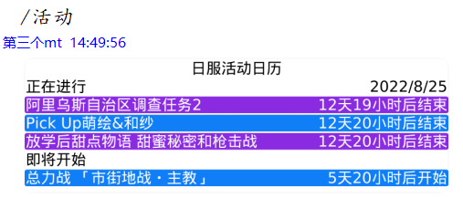
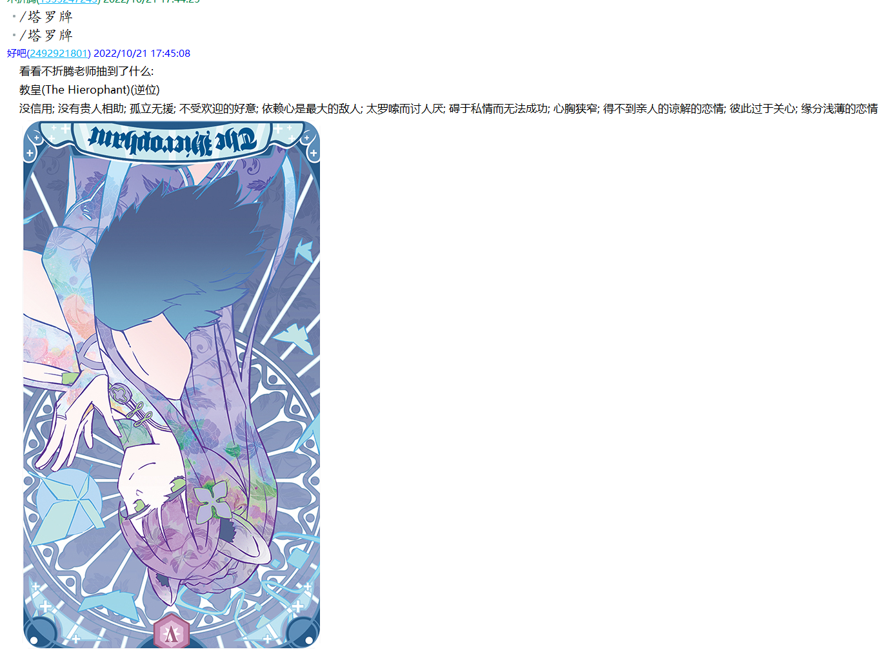
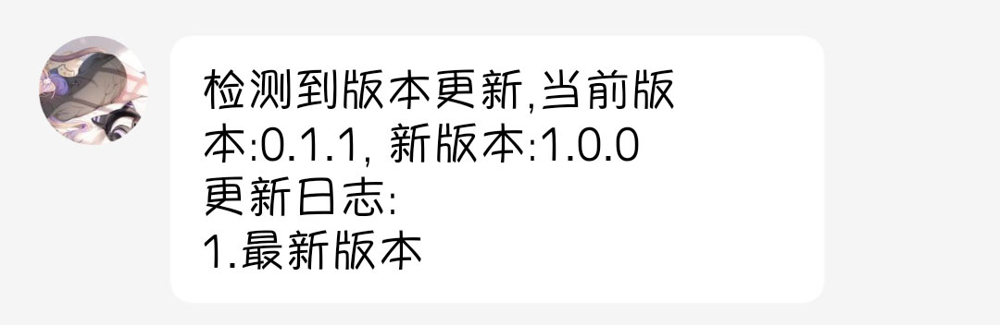
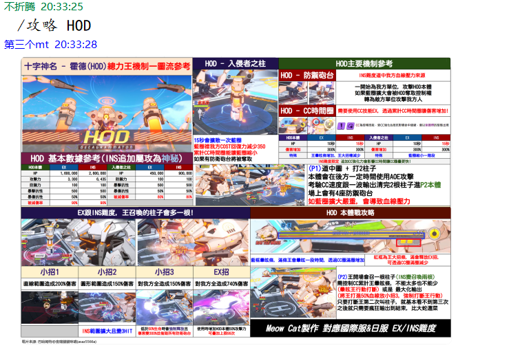

## 声明

<h3>一切开发旨在学习，请勿用于非法用途</h3>

- arona 是一款免费且开放源代码的软件，仅供学习和娱乐用途使用。
- arona 不会通过任何方式强制收取费用，或对使用者提出物质条件。
- arona 由整个开源社区维护，并不是属于某个个体的作品，所有贡献者都享有其作品的著作权。

## 许可证

详见 https://github.com/diyigemt/arona/blob/master/LICENSE

arona 继承 [Mirai](https://github.com/mamoe/mirai) 使用 AGPLv3 协议开源。为了整个社区的良性发展，我们强烈建议您做到以下几点：

- 间接接触到 arona 的软件使用 AGPLv3 开源
- **不鼓励，不支持一切商业使用**

请注意，由于种种原因，开发者可能在任何时间**停止更新**或**删除项目**。

### 衍生软件需声明引用

- 若引用 arona 发布的软件包而不修改 arona ，则衍生项目需在描述的任意部位提及使用 arona 。
- 若修改 arona 源代码再发布，或参考 arona 内部实现发布另一个项目，则衍生项目必须在文章首部或 'arona' 相关内容首次出现的位置明确声明来源于本仓库 ([arona](https://github.com/diyigemt/arona))。
- 不得扭曲或隐藏免费且开源的事实。

## Statement

<h3>All development is for learning, please do not use it for illegal purposes</h3>

- arona is a free and open source software for learning and entertainment purposes only.
- arona will not compulsorily charge fees or impose material conditions on users in any way.
- arona is maintained by the entire open source community and is not a work belonging to an individual. All contributors enjoy the copyright of their work.

## License

See https://github.com/diyigemt/arona/blob/master/LICENSE for details

arona inherits [Mirai](https://github.com/mamoe/mirai) Open source using AGPLv3 protocol. For the healthy development of the entire community, we strongly recommend that you do the following:

- Software indirectly exposed to arona uses AGPLv3 open source
- **Does not encourage and does not support all commercial use**

Please note that for various reasons, developers may **stop updating** or **deleting** projects at any time.

### Derivative software needs to declare and quote

- If you quote the package released by arona without modifying arona , the derivative project needs to mention miraiboot in any part of the description.
- If the arona source code is modified and then released, or another project is released by referring to arona's internal implementation, the derivative project must be clearly stated in the first part of the article or at the location where 'arona'-related content first appears from this repository ([arona](https://github.com/diyigemt/arona)).
- The fact that it is free and open source must not be distorted or hidden.

## 介绍

arona是基于mirai-console的插件。

**本插件依赖的mirai-console版本为2.12.2**

作为BA(Blue Archive)的一款群助手，她可以实现以下功能：

1. 抽卡模拟及数据记录；
2. 国际服/日服活动推送以及防侠提醒；
3. 摸头回复。

<details>
    <summary>活动推送:</summary>
    
</details>

<details>
    <summary>活动结束前防侠:</summary>
    
</details>

<details>
    <summary>活动日历:</summary>
    
</details>

<details>
    <summary>抽卡模拟:</summary>
    
</details>

<details>
    <summary>戳一戳:</summary>
    
</details>

<details>
    <summary>NGA图楼推送:</summary>
    
</details>

<details>
    <summary>塔罗牌:</summary>
    
</details>

<details>
    <summary>不停机管理:</summary>
    
    
</details>

<details>
    <summary>更新检查:</summary>
    
</details>

<details>
    <summary>主线地图图文攻略:</summary>
    
</details>

<details>
    <summary>学生攻略:</summary>
    
</details>

<details>
    <summary>杂图:</summary>
    
    
</details>

## 更新日志

2023-02-14 v1.0.14

1. 修复某些情况下数据库初始化失败导致服务失效的问题
2. 修复服务关闭时不断复读服务未开启的问题
3. 攻略指令新增功能，具体在[这里](./doc/using.md#name-guess-using)，配置在[这里](./doc/using.md#name-guess-config)
4. 移除额外的拼音库依赖

2022-10-26 v1.0.13

1. 修复某些情况下在配置了塔罗牌一日一次后抽取结果正逆位错误的问题

历史日志：[这里](./doc/update.md)

## 版本迁移指南

本节供从v0.1.1升级到v1.0.0-M1的用户阅读

1. 从release下载最新版本的arona文件替换原有在plugins文件夹中的文件
2. 下载并解压release中的`default.zip`，运行其中的`数据库迁移.exe`文件，选中已有的`arona.db`数据库文件进行数据库更新(主要是插入与塔罗牌有关是数据，并不会影响已有的数据)**注意**，即使不会影响已保存的数据库数据，仍建议在进行此操作前对数据库文件进行备份
3. 运行`mirai-console`，使arona在`./config`文件夹下生成新的配置文件
4. **停止**`mirai-console`
5. 在`arona-service.yml`文件中配置各模块的开关
6. 在`arona.yml`文件中配置`managerGroup`管理员组，具有只有具有管理员权限的账号才能对arona进行在线配置
7. 在`nga.yml`文件中配置爬楼所需要的信息，具体配置过程可参考[nga配置](./doc/using.md#nga-config)
8. 在启动后的`mirai-console`中配置新指令的执行权限

```shell
/permission add * net.diyigemt.arona:command.config
/permission add * net.diyigemt.arona:command.tarot
```

即使是这样，我也仍然推荐你重新阅读本readme，里面还包含了对新指令的使用列

## 安装

安装方法：[这里](./doc/install.md)

## 配置和指令

配置和指令：[这里](./doc/using.md)

## 鸣谢

**除第一名外排名不分先后**

[**Haythem723**](https://github.com/Haythem723)(wikiru、SchaleDB爬取模块)

[巴哈姆特@夜喵貓貓咪喵(asaz5566a)](巴哈姆特@夜喵貓貓咪喵(asaz5566a))(学生攻略)

[超级课程表](https://github.com/StageGuard/SuperCourseTimetableBot)(数据库支持)

[碧蓝档案国际服情报站](https://space.bilibili.com/1585224247)(国际服信息来源1)

[SchaleDB](https://lonqie.github.io/SchaleDB/)(国际服信息来源2)

[碧蓝档案wiki](https://wiki.biligame.com/bluearchive/%E9%A6%96%E9%A1%B5)(日服信息来源1)

[碧蓝档案wikiru](https://bluearchive.wikiru.jp/)(日服信息来源2)

[碧蓝档案GameKee](https://ba.gamekee.com/)(国际服/日服信息来源3)

[mirai](https://github.com/mamoe/mirai)(技术支持)

[公主连结图形化活动日历插件](https://github.com/zyujs/pcr_calendar)(图形化活动通知)

非正常学生研究委员会群友(陪我闲聊)
