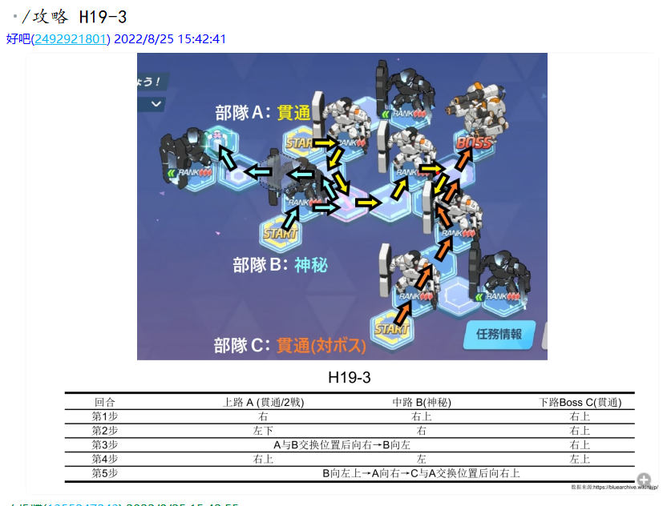
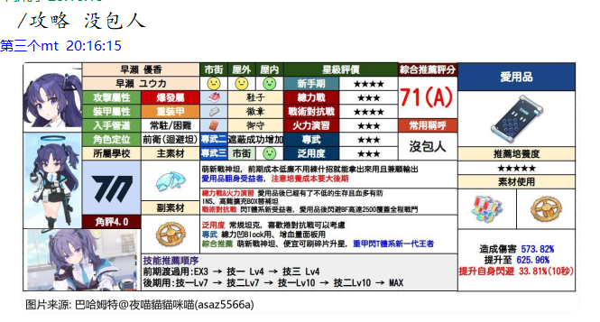
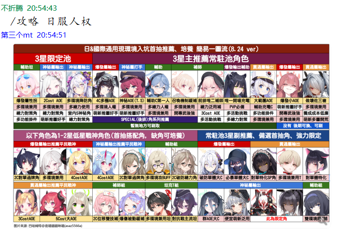
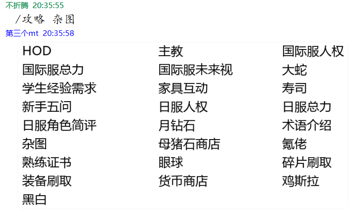
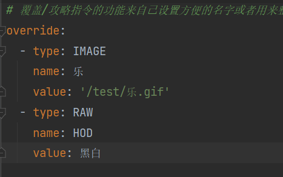
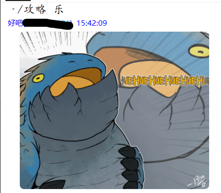
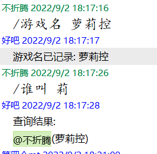
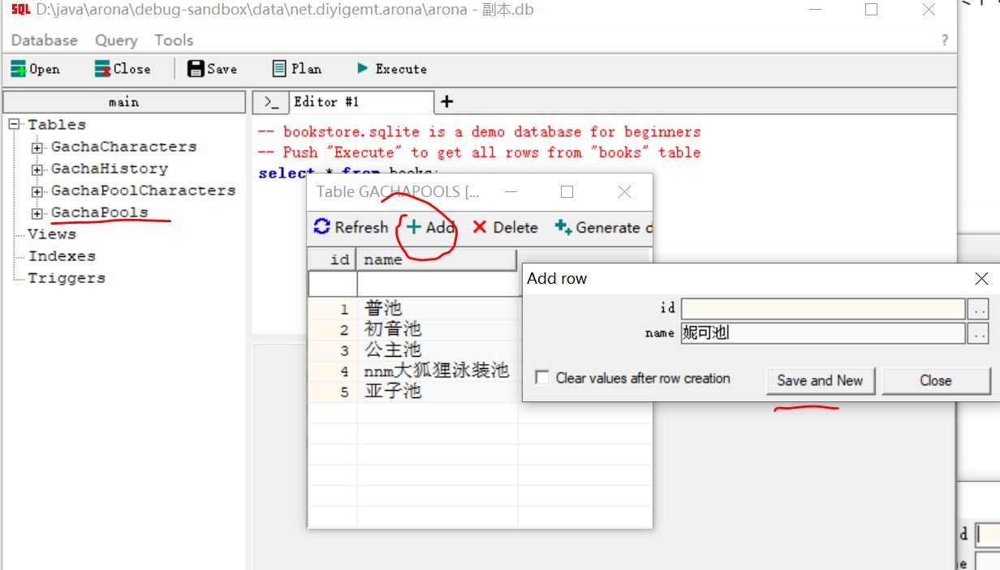
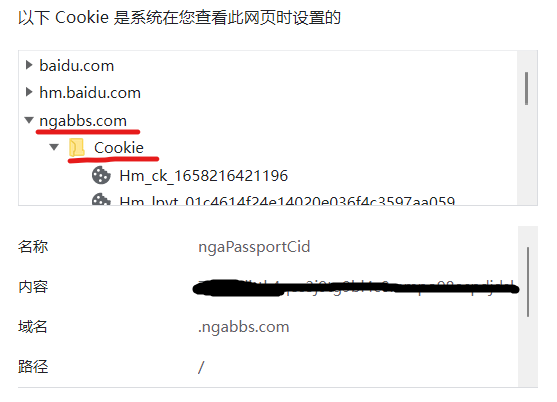

## 指令详解

### 1.主动触发指令

#### 1.1 活动系列

`/活动` 获取默认活动服务器的活动状态，默认服务器配置在[这里看](#default-activity)

`/活动 jp` 获取日服活动状态

`/活动 en` 获取国际服活动状态

#### 1.2 抽卡系列

`/单抽` 单抽一次

`/十连` 抽一次十连

`/狗叫` 查看当前卡池最低抽出pickup次数排行榜

`/历史` 查看抽卡历史记录/几抽1个3星

#### 1.3 抽卡配置系列

`/抽卡 setpool <number>`  设置当前池子为数据库中主键为指定的[number]的池子，如果你不知道这是什么意思，你可以看看[这节](#setpool-config) 

`/抽卡 reset` 重置当前池子的抽卡记录

`/抽卡 1s <number>` 设置1星出货率

`/抽卡 2s <number>` 设置2星出货率

`/抽卡 3s <number>` 设置3星出货率

`/抽卡 rate <number> <number> <number>` 一并设置1、2、3星出货率

`/抽卡 p2s <number>` 设置2星pick up出货率

`/抽卡 p3s <number>` 设置3星pick up出货率

`/抽卡 time <number>` 设置撤回时间

`/抽卡 limit <number>` 设置每日限制次数

**注意** 1、2、3星的出货率支持浮点数且它们的和需要等于100，2、3星pick up出货率不能高于各自的总出货率，否则抽卡功能可能不能正常运行

#### 1.4 发情系列

`/发情 adds <string> [number]`  为发情添加一条回复语句(string)并指定权重为number

`/发情 add {number | @member}` 添加一个发情的监听对象(群友)，其中number为群友qq号，或者直接@群友

`/发情 remove {number | @member}` 删除一个发情的监听对象(群友)，其中number为群友qq号，或者直接@群友

#### 1.5 不停机配置系列

其中的string | number可选值可在[这节看到](#service-names)

`/配置 启用 [string | number] ` 根据名字/id启用一个功能模块

`/配置 停用 [string | number] ` 根据名字/id启用一个功能模块

`/配置 状态 [string | number] ` 根据名字/id查询一个功能模块的状态

`/配置 状态 `  查询所有功能模块的状态

#### 1.6 塔罗牌系列

`/塔罗牌` 抽取一张塔罗牌

#### 1.7 昵称系列<a id="call_me"> </a>

`/叫我` 查询自己的昵称

`/叫我 <string>` 将自己的昵称设置为string

其中名字替换将会在 1.2抽卡系列、arona-nudge的messageList->message、塔罗牌中进行替换

比如arona-nudge.yml的配置为：

```yaml
messageList: 
  - message: '${teacherName}别戳了>_<'
    weight: 1
```

那么${teacherName}将会被替换为用户设置的昵称（假设为萝莉控，且arona.yml->endWithSensei配置为"老师"），最终结果为"萝莉控老师别戳了>_<"

#### 1.8 学生与主线地图攻略系列<a id="main-map"> </a>

`/攻略 <string>`查看主线地图走格子或者学生的图文攻略。

其中学生攻略来源于[巴哈姆特@夜喵貓貓咪喵(asaz5566a)](https://wall.gamer.com.tw/user.php?userId=asaz5566a)

大概长这样

<details>
    <summary>H19-3图文攻略:</summary>
    
</details>

<details>
    <summary>学生攻略:</summary>
    
</details>
其中`string`内容为1-1至H19-3之间或者学生的名字/黑话(可能收集不全)，如查看主线普通地图5-3的攻略，指令为`/攻略 5-3`；

查看主线困难地图H19-3的攻略，指令为`/攻略 H19-3`；

查看佑香的攻略，指令为`/攻略 佑香`或者`/攻略 没包人`?。

1.0.8版本后，额外增加了其他杂项一图流的攻略，例如

<details>
    <summary>HOD图文攻略:</summary>
    
</details>

<details>
    <summary>日服学生人权:</summary>
    
</details>
由于杂图太多而且不好记名字，因此提供指令`/攻略 杂图`显示所有可用的名字列表

<details>
    <summary>杂图列表:</summary>
    
</details>
1.0.9版本后，额外增加了别名覆写功能，在原有基础上用户可自定义简短的别名方便记忆<a id="other-name"> </a>

<details>
    <summary>示例配置:</summary>
    
</details>

<details>
    <summary>效果:</summary>
    
    
</details>

具体配置可看下面的[配置文件详解](#other-name-config)

#### 1.9 游戏名记录<a id="game-name"> </a>

`/游戏名 string` 将自己的游戏名添加到记录中。

`/[谁叫|谁是] string` 根据提供的字符串模糊查询游戏名包含字符串的群友。

以上命令也可以通过群私聊机器人调用，此时`谁是`指令将只提供游戏内名称并附上对应qq号。

<details>
    <summary>例如:</summary>
    
</details>

由于是模糊查询的原因，查询结果可能会涉及多个群友，没事把人家@出来也不好，因此1.0.8后查询结果将不会再@。

## 配置文件详解<a id="config"> </a>

### 1.arona.yml

arona总的配置。

| 键                      | 属性         | 作用                                                         |
| ----------------------- | ------------ | ------------------------------------------------------------ |
| qq                      | Long         | 指定arona运行在哪个机器人上                                  |
| groups                  | List\<Long\> | 指定arona响应哪个群的消息                                    |
| managerGroup            | List\<Long\> | 指定具有arona管理权限的qq号                                  |
| permissionDeniedMessage | String       | 当不具有管理员的用户尝试执行需要管理权限的指令时的回复消息,为空则不回复 |
| sendOnlineMessage       | Boolean      | 是否发送arona上线消息                                        |
| onlineMessage           | String       | 上线消息内容                                                 |
| sendOfflineMessage      | Boolean      | 是否发送arona下线消息                                        |
| offlineMessage          | String       | 下线消息内容                                                 |
| updateCheckTime         | Int          | 每日检查更新的时间(24小时制)                                 |
| endWithSensei           | String       | 名称是否自动带上后缀，默认为"老师"，可以留空                 |
| sendStatus              | Boolean      | 是否允许arona收集匿名统计信息(未实装)                        |
| uuid                    | String       | 识别id(无需修改)                                             |

### 2.arona-service.yml<a id="service-names"> </a>

各功能模块开关的配置。

| 键             | id   | 属性    | 作用                                   |
| -------------- | ---- | ------- | -------------------------------------- |
| 配置           | 0    | Boolean | 是否开启不停机修改本配置文件内容的功能 |
| 抽卡配置       | 1    | Boolean | 是否开启不停机修改激活的卡池功能       |
| 发情配置       | 2    | Boolean | 是否开启不停机修改发情配置的功能       |
| 活动查询       | 3    | Boolean | 是否开启当前日服/国际服活动查询指令    |
| 抽卡单抽       | 4    | Boolean | 是否开启单抽指令                       |
| 抽卡十连       | 5    | Boolean | 是否开启十连指令                       |
| 抽卡狗叫查询   | 6    | Boolean | 是否开启抽卡狗叫查询指令               |
| 抽卡历史查询   | 7    | Boolean | 是否开启抽卡历史查询指令               |
| 复读           | 8    | Boolean | 是否开启复读功能                       |
| 发情           | 9    | Boolean | 是否开启发情回怼功能                   |
| 摸头回复       | 10   | Boolean | 是否开启摸头回复功能                   |
| 岁月史书       | 11   | Boolean | 是否开启岁月史书功能(暂时没做)         |
| 活动推送       | 12   | Boolean | 是否开启活动防侠推送功能               |
| nga图楼推送    | 13   | Boolean | 是否开启NGA图楼推送功能                |
| 自动更新检查   | 14   | Boolean | 是否开启每日更新检查功能               |
| 合并转发       | 15   | Boolean | 是否开启多图合并转发功能(暂时没做)     |
| 塔罗牌         | 16   | Boolean | 是否开启塔罗牌指令                     |
| 自定义昵称     | 18   | Boolean | 是否启用自定义昵称                     |
| 数据同步服务   | 19   | Boolean | 是否自动从SchaleDB同步活动消息         |
| 地图与学生攻略 | 20   | Boolean | 是否启用地图攻略功能                   |
| 游戏名记录     | 21   | Boolean | 是否启用记录游戏名与群名对应关系的功能 |
| 游戏名反查     | 22   | Boolean | 是否启用查询游戏名对应的群名的功能     |

### 3.arona-gacha.yml

抽卡模块配置。

**注意**1、2、3星总出率加起来需要达到100%，2、3星限定出率不能超过各自的总出率。

当前激活的池子的设置与数据库有关，将会在下一节进行讨论。

| 键              | 属性  | 作用                                                      |
| --------------- | ----- | --------------------------------------------------------- |
| star1Rate       | Float | 1星总出率百分比                                           |
| star2Rate       | Float | 2星总出率百分比                                           |
| star3Rate       | Float | 3星总出率百分比                                           |
| star2PickupRate | Float | 2星限定出率百分比                                         |
| star3PickupRate | Float | 3星限定出率百分比                                         |
| activePool      | Int   | 当前激活的池子                                            |
| revokeTime      | Int   | 撤回结果信息防止刷屏 撤回时间间隔(单位为秒) 为0表示不撤回 |
| day             | Int   | 保存上一次更新抽卡信息的日期                              |
| limit           | Int   | 每天每人最多抽几次，设置为0表示不限制                     |

### 4.arona-notify.yml

防侠通知模块设置。**注意**，时间按24小时计。

除了双倍掉落提醒时间为晚上22点外，防侠提醒会在活动结束前1个小时进行，因为双倍掉落是在晚上3点结束，2点提醒有点阴间。

| 键                           | 属性    | 作用                                                         |
| ---------------------------- | ------- | ------------------------------------------------------------ |
| enableEveryDay               | Boolean | 是否启用每日防侠提醒功能                                     |
| notifyType                   | String  | 每日提醒类型,可选ALL(提醒所有时段),ONLY_24H(仅提醒24小时内),ONLY_48H(仅提醒48小时内) |
| everyDayHour                 | Boolean | 每日防侠提醒的时间(同时也是每日数据更新时间)                 |
| enableJP                     | Boolean | 是否启用日服防侠提醒                                         |
| notifyStringJP               | Int     | 日服防侠提醒开头文字                                         |
| enableEN                     | Boolean | 是否启用国际服防侠提醒                                       |
| notifyStringEN               | Int     | 国际服防侠提醒开头文字                                       |
| defaultActivityCommandServer | Enum    | "/活动"指令的默认目标服务器,可选值为 "JP"和"GLOBAL"          |
| defaultJPActivitySource      | Enum    | "/活动 jp"指令的默认数据源,可选值为 "B_WIKI", "WIKI_RU", "GAME_KEE" 和"SCHALE_DB" |
| defaultENActivitySource      | Enum    | "/活动 en"指令的默认数据源,可选值为 "SCHALE_DB", "BILIBILI", 和"GAME_KEE" |

例如`defaultActivityCommandServer`配置为`JP`，那么直接执行`/活动`指令也可以得到和执行`/活动 jp`一致的效果<a id="default-activity"> </a>

### 5.arona-nudge.yml

摸头模块配置。

| 键          | 属性                       | 作用                            |
| ----------- | -------------------------- | ------------------------------- |
| messageList | List<Data<String, weight>> | 回复消息列表以及权重            |
| priority    | EventPriority              | 事件优先级，与mirai-console有关 |

### 6.arona-repeat.yml

复读模块配置。

| 键    | 属性 | 作用                               |
| ----- | ---- | ---------------------------------- |
| times | Int  | 当一条消息被重复几次后进行一次复读 |

### 7.arona-hentai.yml

发情回怼模块配置。目前只会对消息内容中含有"老婆"或者"老公"字样的消息进行回复。

作用是应对群友互相发情的，可以不用管。

| 键          | 属性                       | 作用                 |
| ----------- | -------------------------- | -------------------- |
| messageList | List<Data<String, weight>> | 回复消息列表以及权重 |
| listen      | List\<Long>                | 监听的群友QQ号       |

### 8.arona-tarot.yml

塔罗牌配置。

| 键     | 属性   | 作用                                                         |
| ------ | ------ | ------------------------------------------------------------ |
| dayOne | Boolen | 是否每天只能抽一张，为true时一天中同一个人在同一个群中的抽卡结果相同 |

### 9.arona-trainer.yml <a id="other-name-config"> </a>

别名配置。

| 键       | 属性                                     | 作用                      |
| -------- | ---------------------------------------- | ------------------------- |
| override | List<TrainerOverride(type, name, value)> | 覆写指令`/攻略`提供的参数 |

`type` 字段是一个枚举值，可选的有`IMAGE, RAW, CODE`

`name` 为要覆盖的原始值，当`/攻略` 指令后接的参数与该值一致时执行`type`对应的动作

`value` 为覆盖后的值，根据`type`的不同也有不同的填写要求

`IMAGE`：代表当规则生效时，发送一张`path`指向的图片，其中`path`值的相对目录为`./data/net.diyigemt.arona/image`

配置示例:

```yaml
override:
  - type: IMAGE
  	name: '乐'
  	value: '/test/乐.gif'
```

代表当指令为`/攻略 乐`时，发送`./data/net.diyigemt.arona/image`文件夹下`test`子文件夹中的`乐.gif`图片

`RAW`：代表当规则生效时，将`name`替换成`value`继续执行原有逻辑

配置示例:

```yaml
override:
  - type: RAW
  	name: 'HOD'
  	value: '黑白'
```

代表当指令为`/攻略 HOD`时，发送`黑白`的攻略图片，效果如下

<details>
    <summary>效果:</summary>
    
</details>

`CODE`：代表当规则生效时，将`value`的值看作`mirai-code`反序列化为消息片段并发送

`mirai-code`简单来说就是机器人启动后每收到一条消息在`mirai-console`中的打印值，具体解释可以看[这里](https://docs.mirai.mamoe.net/Messages.html#mirai-%E7%A0%81)

配置示例:

```yaml
override:
  - type: CODE
  	name: '黑服'
  	value: '南通爬'
```

代表当指令为`/攻略 黑服`时，发送`南通爬`。后期将会支持@对应发送人的功能

### 10.nga.yml

NGA图楼推送配置，具体配置方法可以看[下面](#nga-config)

| 键            | 属性                    | 作用                                                         |
| ------------- | ----------------------- | ------------------------------------------------------------ |
| uid           | String                  | 你自己的nga uid                                              |
| cid           | String                  | 你自己的nga cid                                              |
| checkInterval | Int                     | 扫描周期，单位min                                            |
| source        | MAIN / SUB              | 配置nga数据来源，可选MAIN或SUB，防止nga炸了，main是ngabbs，sub是178.现在应该只有178能用了。 |
| watch         | Map<Int, String>        | 监听的nga cid(无须修改)                                      |
| cache         | List<Pair<Int, String>> | 已经推送过的楼层缓存(无须修改)                               |

## 数据库详解

**注意**可能会夹带私货。

数据库目前有四张表，主要是为了抽卡模块服务。

1.GachaCharacters表

用以保存池子中的所有老婆信息并区分是否是限定。

| 键    | 属性        | 作用           |
| ----- | ----------- | -------------- |
| id    | INTEGER     | 主键           |
| name  | VARCHAR(10) | 老婆名字       |
| star  | INT         | 老婆初始星级   |
| limit | BOOL        | 老婆是否是限定 |

2.GachaPools表

用以保存各池子的信息。

| 键   | 属性        | 作用     |
| ---- | ----------- | -------- |
| id   | INTEGER     | 主键     |
| name | VARCHAR(50) | 池子名字 |

3.GachaPoolCharacters表

用以保存各池子中限定pickup的信息。

| 键           | 属性    | 作用                   |
| ------------ | ------- | ---------------------- |
| id           | INTEGER | 主键                   |
| pool_id      | INTEGER | 外键，指向限定池表主键 |
| character_id | INTEGER | 外键，指向老婆表主键   |

4.GachaHistoryTable表

用以保存抽卡记录。

| 键     | 属性    | 作用                                              |
| ------ | ------- | ------------------------------------------------- |
| qq     | BIGINT  | 主键1，是群员QQ号                                 |
| group  | BIGINT  | 主键2，群员所在群号                               |
| pool   | INTEGER | 主键3，外键，指向限定池表主键，区分不同池子的记录 |
| points | INTEGER | 记录这个池子抽了多少发                            |
| count3 | INTEGER | 记录抽出几个三星                                  |
| dog    | INTEGER | 记录几抽抽出pickup                                |

目前数据库中记录了5个池子，它们的id的对应内容为：

| id   | 内容           |
| ---- | -------------- |
| 1    | 普池           |
| 2    | 初音池         |
| 3    | 公主池         |
| 4    | nnm大狐狸池    |
| 5    | 亚子池         |
| 6    | 小夏池         |
| 7    | 水大叔池       |
| 8    | 水千世老板娘池 |
| 9    | 爱丽丝骑白子池 |
| 10    | 86新春池 |
| 11    | 纱织池 |
| 12    | 春黑池 |
| 13    | 小黑猫大兔子 |
| 14    | 大狐狸 |
| 15    | 泳装2期 |

5.GachaLimit表

保存抽卡限制信息

| 键    | 属性    | 作用                |
| ----- | ------- | ------------------- |
| qq    | BIGINT  | 主键1，也是群员QQ号 |
| group | BIGINT  | 主键2，群员所在群号 |
| count | INTEGER | 今天抽了几次        |

6.Tarot表

保存塔罗牌信息

| 键       | 属性     | 作用     |
| -------- | -------- | -------- |
| id       | INTEGER  | 主键     |
| name     | CHAR(30) | 牌名     |
| positive | TEXT     | 正位解释 |
| negative | TEXT     | 逆位解释 |

7.TarotRecord表

保存塔罗牌抽取信息信息，当`arona-tarot.yml->dayOne=false`时不使用

| 键       | 属性    | 作用                    |
| -------- | ------- | ----------------------- |
| qq       | BIGINT  | 主键1，也是群员QQ号     |
| group    | BIGINT  | 主键2，群员所在群号     |
| tarot    | INTEGER | 外键，对应Tarot表中的id |
| positive | BOOL    | true:正位               |

8.TeacherName表

保存群友自定义的昵称

| 键    | 属性   | 作用                |
| ----- | ------ | ------------------- |
| qq    | BIGINT | 主键1，也是群员QQ号 |
| group | BIGINT | 主键2，群员所在群号 |
| name  | CHAR   | 昵称                |

9.Image表

保存本地图片文件信息

| 键   | 属性    | 作用                                            |
| ---- | ------- | ----------------------------------------------- |
| id   | BIGINT  | 主键                                            |
| name | CHAR    | `/攻略`指令对应的名称                           |
| path | CHAR    | 文件相对于./data/net.diyigemt.arona/image的路径 |
| hash | CHAR    | 文件md5值，据此判断文件是否需要更新             |
| type | INTEGER | 文件类型，留着扩展用                            |

### 新卡池添加方法<a id="setpool-config"> </a>

1. 停止mirai-console的运行；
2. 从`./data/net.diyigemt.arona/arona.db`获取db文件；
3. 编辑db文件，在GachaCharacters表中插入新老婆的信息；
4. 在GachaPools表中插入新池的信息；
5. 在GachaPoolCharacters表中插入新池与限定角色的关联信息；
6. 使用编辑好的数据库文件替换`./data/net.diyigemt.arona/arona.db`下的文件；
7. 启动mirai-console，在群聊中发送指令`/gacha setpool <number>`，其中number为第4步中新池的主键

如果你不会使用SQLite也没关系，下面我模拟一下这种情况，比如日服新出了粉狐狸然后up了，该如何添加这个池子。

1. 下载任意一个可以编辑SQLite的软件，比如[sqlite-gui](https://github.com/little-brother/sqlite-gui/releases/download/1.7.5/sqlite-gui.1.7.5-x64.zip)
2. 使用工具栏中的`open`选项打开获取到的池子文件，如下图

<details>
    <summary>步骤2:</summary>
    
</details>
3. 双击`Tables`栏中的`GachaCharacters`数据表，编辑新老婆信息

<details>
    <summary>步骤3:</summary>
    
</details>
其中`name`为老婆名字;`star`为老婆初始星级；`limit`表示老婆是限定还是常驻，其中1表示限定、0表示常驻；`id`为自动生成，无需填写。

填写完毕后单击`Save and New`保存，即可关闭页面。

4. 双击`Tables`栏中的`GachaPools`数据表，编辑新池子信息

<details>
    <summary>步骤4:</summary>
    
</details>
同上，只需要填入`name`作为新池子的名字即可。

5. 双击`Tables`栏中的`GachaPoolCharacters`数据表，编辑新池子与新老婆的对应关系信息

<details>
    <summary>步骤5-1:</summary>
    
</details>
其中`pool_id`为之前新建池子的主键，可以在这里看到

<details>
    <summary>步骤5-2:</summary>
    
</details>
同理，`character_id`为之前新建的老婆信息的主键

<details>
    <summary>步骤5-3:</summary>
    
</details>
**特别的**，一个池子可以有多个pickup，因此可以根据需要在`GachaPoolCharacters`对同一个池子添加多条数据。

至此，数据库编辑完毕。

6. 使用编辑好的数据库文件替换`./data/net.diyigemt.arona/arona.db`文件；
7. 启动mirai-cosole，在群聊中发送指令`/gacha setpool <number>`，其中number为第4步中新池的主键，即可启用新的池子。

## NGA模块配置方法<a id="nga-config"> </a>

uid:填入你自己的nga的uid，可以在这里看到

<details>
    <summary>uid位置</summary>
    
</details>
cid:这个就比较复杂了，首先你需要知道你所使用的浏览器如何查看当前网页使用的cookie内容，这里以chrome为例，其他浏览器请自行百度

<details>
    <summary>步骤1</summary>
    
</details>
<details>
    <summary>步骤2</summary>
    
</details>
<details>
    <summary>步骤3</summary>
    
</details>

将这串复制填入`nga.yml`对应的位置即可

**注意**，如果在NGA执行登出操作这段内容可能会失效，需要停止mirai然后更新配置文件至新的内容